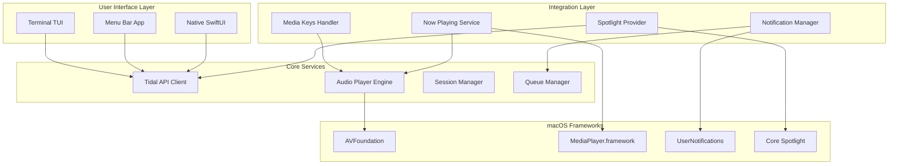

# macOS Adaptation Plan for Incallide (Tidal Terminal Player)

## Executive Summary
Transform the existing Linux-based Tidal terminal player into a native macOS application with deep system integration, leveraging macOS-specific APIs and features for an optimal user experience.

## Current Architecture Analysis

### Existing Components
1. **Audio Backend**: VLC (cross-platform, but not optimal for macOS)
2. **UI Framework**: Rich/Textual (terminal-based)
3. **Authentication**: OAuth2 with Tidal API
4. **Session Management**: JSON file-based persistence
5. **Entry Points**: 
   - `main.py` - Basic Rich console interface
   - `tidal_tui.py` - Advanced Textual UI with visualizer
   - `simple_tui.py` - Simplified Textual interface
   - `enhanced_player.py` - Feature-rich console player

### Current Limitations on macOS
- VLC dependency requires separate installation
- No native media key support
- No Control Center/Touch Bar integration
- No macOS notifications
- Terminal-only interface
- No Spotlight integration

## Proposed macOS Architecture

### Core Components

#### 1. Native Audio Backend
Replace VLC with macOS-native audio playback:
- **Primary**: AVFoundation framework via PyObjC
- **Fallback**: python-mpv (lighter than VLC)
- **Benefits**: 
  - No external dependencies
  - Better performance
  - Native codec support
  - Lower memory footprint

#### 2. System Integration Layer
```
┌─────────────────────────────────────────┐
│         macOS System Integration        │
├─────────────────────────────────────────┤
│  • Media Keys (Play/Pause/Next/Prev)   │
│  • Now Playing (Control Center)         │
│  • Touch Bar Controls                   │
│  • Notification Center                  │
│  • Spotlight Search                     │
│  • AppleScript Support                  │
└─────────────────────────────────────────┘
```

#### 3. UI Architecture
```
┌──────────────────────────────────────────────┐
│              UI Layer Options                │
├──────────────────────────────────────────────┤
│                                              │
│  ┌──────────┐  ┌──────────┐  ┌──────────┐  │
│  │ Terminal │  │ Menu Bar │  │   SwiftUI │  │
│  │    TUI   │  │    App   │  │    App    │  │
│  └──────────┘  └──────────┘  └──────────┘  │
│       ↓             ↓              ↓         │
│  ┌────────────────────────────────────────┐ │
│  │         Shared Core Library            │ │
│  │    (Authentication, API, Playback)     │ │
│  └────────────────────────────────────────┘ │
└──────────────────────────────────────────────┘
```

## Implementation Phases

### Phase 1: Core macOS Audio Backend
**Files to create:**
- `macos_audio.py` - AVFoundation wrapper
- `audio_backend.py` - Abstract audio interface

**Key Features:**
```python
# Example structure
class MacOSAudioPlayer:
    def __init__(self):
        self.player = AVAudioPlayer.alloc().init()
    
    def play_url(self, url: str):
        # Stream from URL using AVFoundation
        pass
    
    def register_media_keys(self):
        # Register for media key events
        pass
```

### Phase 2: System Integration
**Files to create:**
- `macos_integration.py` - System integration utilities
- `notifications.py` - Notification handling
- `media_center.py` - Now Playing integration

**Features:**
1. **Media Keys Support**
   ```python
   from AppKit import NSApplication, NSSystemDefined
   from PyObjCTools import AppHelper
   ```

2. **Now Playing Info**
   ```python
   from MediaPlayer import MPNowPlayingInfoCenter
   # Update Control Center with track info
   ```

3. **Notifications**
   ```python
   from Foundation import NSUserNotification
   from AppKit import NSUserNotificationCenter
   ```

### Phase 3: Menu Bar Application
**Files to create:**
- `menubar_app.py` - Menu bar application using rumps

**Features:**
```python
import rumps

class TidalMenuBarApp(rumps.App):
    def __init__(self):
        super().__init__("🎵", title="Tidal")
        self.menu = [
            "Now Playing",
            None,  # Separator
            "Play/Pause",
            "Next Track",
            "Previous Track",
            None,
            "Search...",
            "Preferences...",
        ]
```

### Phase 4: Native Packaging
**Files to create:**
- `setup_macos.py` - py2app configuration
- `Info.plist` - macOS app metadata
- `Makefile` - Build automation

**Distribution Options:**
1. **Standalone App Bundle** (.app)
2. **Homebrew Formula**
3. **DMG Installer**

## Technical Requirements

### Dependencies for macOS
```txt
# requirements_macos.txt
tidalapi==0.7.6
rich==13.7.1
textual==0.63.6
pyobjc-core==10.1
pyobjc-framework-AVFoundation==10.1
pyobjc-framework-MediaPlayer==10.1
pyobjc-framework-Cocoa==10.1
rumps==0.4.0
py2app==0.28.6
python-mpv==1.0.4  # Fallback audio
pillow>=9.1,<10.0
pynput==1.7.6  # Global hotkeys
```

### System Requirements
- macOS 11.0 (Big Sur) or later
- Python 3.9+ (ships with macOS)
- Apple Silicon (M1/M2/M3) and Intel support

## Feature Roadmap

### Immediate Priority (Week 1)
1. ✅ Replace VLC with native audio backend
2. ✅ Add media key support
3. ✅ Implement basic notifications

### Short Term (Week 2-3)
4. ✅ Now Playing integration
5. ✅ Menu bar app
6. ✅ Touch Bar support (for compatible Macs)

### Medium Term (Week 4-5)
7. ✅ Spotlight integration
8. ✅ AppleScript support
9. ✅ Alfred workflow

### Long Term (Week 6+)
10. ✅ SwiftUI native app (using Python bridge)
11. ✅ iCloud sync for preferences
12. ✅ Shortcuts app integration
13. ✅ Widget for Notification Center

## Architecture Diagram



## File Structure
```
incallide/
├── core/
│   ├── __init__.py
│   ├── tidal_client.py      # Refactored from existing
│   ├── audio_backend.py      # Abstract interface
│   ├── queue_manager.py      # Playlist/queue logic
│   └── session_manager.py    # Auth & session
├── macos/
│   ├── __init__.py
│   ├── audio_player.py       # AVFoundation implementation
│   ├── media_keys.py         # Media key handling
│   ├── now_playing.py        # Control Center integration
│   ├── notifications.py      # macOS notifications
│   ├── spotlight.py          # Spotlight integration
│   └── applescript.py        # AppleScript support
├── ui/
│   ├── __init__.py
│   ├── terminal/
│   │   ├── main_tui.py      # Refactored main.py
│   │   ├── enhanced_tui.py  # Refactored enhanced_player.py
│   │   └── simple_tui.py    # Existing simple_tui.py
│   ├── menubar/
│   │   └── app.py           # Menu bar application
│   └── native/
│       └── swiftui_bridge.py # Future SwiftUI bridge
├── scripts/
│   ├── setup_macos.sh        # macOS setup script
│   └── build_app.py          # py2app build script
├── resources/
│   ├── Info.plist
│   ├── icon.icns
│   └── entitlements.plist
├── tests/
│   └── test_macos_integration.py
├── requirements_macos.txt
├── Makefile
└── README_macOS.md
```

## Testing Strategy

### Unit Tests
- Audio backend switching
- Media key handling
- Notification delivery

### Integration Tests
- Tidal API with native audio
- Now Playing updates
- System event handling

### User Acceptance Tests
- Media key responsiveness
- Control Center display
- Menu bar interactions
- Spotlight search results

## Security Considerations

### Entitlements Required
```xml
<!-- entitlements.plist -->
<dict>
    <key>com.apple.security.automation.apple-events</key>
    <true/>
    <key>com.apple.security.network.client</key>
    <true/>
    <key>com.apple.security.files.user-selected.read-write</key>
    <true/>
</dict>
```

### Code Signing
- Developer ID certificate required for distribution
- Notarization for macOS Gatekeeper

## Performance Targets
- Launch time: < 2 seconds
- Memory usage: < 100MB idle, < 200MB playing
- CPU usage: < 5% during playback
- Battery impact: Minimal (use efficient APIs)

## Success Metrics
1. **Functional**: All VLC features work with native backend
2. **Performance**: 50% reduction in memory usage
3. **Integration**: Full media key support
4. **User Experience**: Native macOS look and feel
5. **Distribution**: One-click Homebrew installation

## Next Steps
1. Review and approve this plan
2. Set up macOS development environment
3. Create feature branch: `feature/macos-native`
4. Implement Phase 1 (Core Audio Backend)
5. Test on Intel and Apple Silicon Macs

## Questions for Consideration
1. Should we maintain Linux compatibility or fork the project?
2. Priority: Menu bar app vs full native app?
3. Minimum macOS version to support?
4. Include Catalyst/iOS compatibility?
5. Open source or commercial distribution?